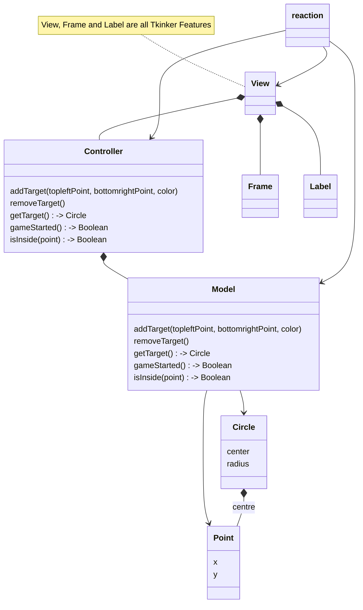

# Reaction

A simple Model/View/Controller application to learn about MVC

This game will display a circle on a canvas. The player will try and click inside the circle. 
The result is either a hit or miss and the reaction time is recorded and displayed.

# Class Diagram
The `reaction` class is the root application. It is responsible for setting up the Model, View, Controller instances.

The `View` Class deals **exclusively** with all this GUI. It does not or should not know anything about the internals of the game logic.

The `Model` Class deals **exclusively** with the game logic. It does not or should not know anything about how the look and feel of the game is.

The `Controller` Class is the glue that binds the `View` with the `Model`

The `Circle` Class represents the TARGET the player will try and hit.

The `Point` Class is used to represent the position of the mouse click. But also an instance is used to represent the centre of the circle

OOP Composition is used by the `reaction` class to set up things:
* The `View` `__init__` constructor takes in an instance of a `Controller` as a composite relationship
* The `Controller` `__init__` constructor takes in an instance of a `Model` as a composite relationship

# Game Logic

When a player clicks to start the game, a circle is presented on the canvas at a random time.
Once the circle is created, its creation time is recorded.
When a player clicks in an attempt to hit the circle, a point instance for the click is recorded and the time of the click.
This time is the reaction time.
If the distance between that point and the center of the circle is less than the circle radius, then the player has succeed in hitting the target.
